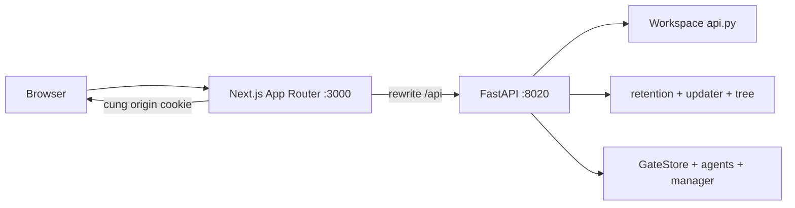

# Kế hoạch chuyển giao diện web sang Next.js

> **Trạng thái (API/UI đã hoàn thiện song song, chưa cutover).** Đã dựng view-model JSON trong
> [`view.py`](../src/analysis_system/web/view.py), thêm kênh phiên JSON
> `GET/POST/DELETE /api/session` trong [`app.py`](../src/analysis_system/web/app.py),
> và khung Next.js tại [`frontend/`](../frontend) (App Router, rewrite `/api/*`
> → `http://127.0.0.1:8020`, component đăng nhập). Đã chạy song song hai kênh:
> SSR cũ :8020 + Next :3000, đăng nhập round-trip qua rewrite hoạt động
> (sai mật khẩu → 401 JSON; đúng → cookie `asys_session` dùng chung). Các
> contract JSON hiện bao phủ session, read path, answer/download và approve
> retry; `test_web.py` và `test_web_state.py` vẫn xanh. Smoke browser đã đi qua đăng nhập →
> dataset → hỏi → polling → kết quả → hỏi tiếp; cassette offline cho ask → answer đã có
> trong contract test. Còn lại là full suite có Tesseract và rehearsal deployment trên máy
> có Docker daemon trước khi chuyển UI chính.

## 1. Mục tiêu và phạm vi

Chuyển **tầng trình bày** (hiện là HTML server-render trong [`render.py`](../src/analysis_system/web/render.py)) sang **Next.js (React, App Router)**. Phần backend phân tích — [`api.py`](../src/analysis_system/api.py), manager, agents, services — **giữ nguyên**, chỉ phơi thêm **API JSON**.

Hai nguyên tắc bất biến:

1. **Không viết lại luật nghiệp vụ.** Mọi quyết định (gate nào chờ duyệt, lượt nào đang chạy, kết luận nào bị chặn, số liệu nào được vẽ...) phải nằm phía Python, trả về JSON. React chỉ vẽ.
2. **Không phá test hiện có khi đang chuyển.** Route HTML SSR giữ nguyên chạy song song tới khi Next thay toàn bộ; `test_web.py` chỉ bị thay ở **pha cuối** và được thay bằng test API có cùng ý nghĩa.

Lý do: phần "mượt" bạn muốn không đến từ framework mà từ **bỏ full page reload**. Next.js cho phép làm vậy; nhưng phải có API JSON chuẩn trước đã.

---

## 2. Kiến trúc đích

### 2.1 Hai tầng, một origin

```
Browser  ──►  Next.js (:3000)  ──rewrite /api/*──►  FastAPI (:8020)
                │  App Router                         │
                │  (React, no full reload)            │ Workspace + agents + services
                │                                     │ (giữ nguyên, chỉ thêm view-model)
                ◄────────────── JSON ─────────────────┘
```

- **Next.js giữ mọi route UI** (`/`, `/du-lieu`, `/bang-dieu-khien`, `/he-thong`, `/bo/{dataset}`, `/bo/{dataset}/sach`, `/bo/{dataset}/pt/{run}`).
- **Next proxy (rewrite) mọi `/api/*`** sang FastAPI → trình duyệt chỉ thấy một origin, **cookie session của [`auth.py`](../src/analysis_system/web/auth.py) dùng nguyên** (không CORS, không CSRF mới).
- FastAPI tiếp tục phục vụ các **tệp nhị phân** (chart PNG `/api/anh/*`, CSV, Excel, Word) qua rewrite — không đưa vào Next.
- File tải xuống giữ header `content-disposition` nguyên vẹn qua rewrite.



### 2.2 Tầng view-model mới trên Python

Thêm file `web/view.py` (hoặc `web/api_json.py`) — **người trình bày thứ ba**: gọi `Workspace` + `retention` + `tree` + `updater`, trả **dict/Pydantic model thuần JSON**. Không sửa render.py ở bước này.

Mọi dataclass phục vụ hiển thị phải có bộ chuyển JSON:

| Loại                                                                            | Nơi định nghĩa                                                          | Ghi chú                                                        |
| ------------------------------------------------------------------------------- | ----------------------------------------------------------------------- | -------------------------------------------------------------- |
| `RunInfo`                                                                       | [`retention.py:43`](../src/analysis_system/services/retention.py)       | run_id, started, phase, tasks, files, bytes_used, age_days     |
| `RunReport` / `TableReport` / `CleanReport` / `GateReport` / `GateOptionReport` | [`api.py:145-217`](../src/analysis_system/api.py)                       | kết quả chạy, mô tả bảng, gate chờ duyệt                       |
| `ManagerAnswer`                                                                 | [`contracts/agents.py:484`](../src/analysis_system/contracts/agents.py) | BaseModel sẵn → `model_dump(mode="json")`                      |
| `Node` (cây sidebar)                                                            | [`web/tree.py`](../src/analysis_system/web/tree.py)                     | dựng cây bên Python, React vẽ nguyên cây                       |
| `Version` / `Update`                                                            | [`services/updater.py:38`](../src/analysis_system/services/updater.py)  | trang Hệ thống                                                 |
| trạng thái bộ dữ liệu                                                           | đang nằm trong render (`_dataset_state`, `_state_of`, `split_rounds`)   | **phải tách khỏi render.py** thành hàm trả dữ liệu, React dùng |

**Quy tắc tách:** hàm render nào chứa `if` về _dữ liệu_ (đang chạy/chưa/đã xong, có kết quả hay không, claim bị chặn hay không) thì chuyển quyết định đó thành flag trong JSON; render.py gọi lại flag để vẽ HTML cũ, React vẽ bằng cùng flag — **một luật, một nguồn**.

---

## 3. Bản đồ trang ↔ API ↔ dữ liệu

### 3.1 Đăng nhập / phiên

| Hiện tại (SSR)                    | API JSON mới                                          |
| --------------------------------- | ----------------------------------------------------- |
| `GET /dang-nhap` (form)           | `GET /api/session` → `{signed_in, error?}`            |
| `POST /dang-nhap` (form password) | `POST /api/session` → set cookie, `200`/`401 {error}` |
| `POST /dang-xuat`                 | `DELETE /api/session`                                 |

Cookie: giữ `SESSION_COOKIE` + `httponly` + `samesite=strict`; Next gửi kèm credential (cùng origin). `GET /` khi chưa đăng nhập ở Next trả trang đăng nhập (không redirect mù — client hiểu trạng thái qua `/api/session`).

### 3.2 Bốn trang chính

| Route                     | API JSON                 | Dữ liệu                                                                            |
| ------------------------- | ------------------------ | ---------------------------------------------------------------------------------- |
| `/`                       | `GET /api/home`          | danh sách run gốc (`RunInfo[]`, đã lọc `ROUND_MARK`) + trạng thái đang chạy        |
| `/du-lieu`                | `GET /api/data`          | `RunInfo[]` + **trạng thái từng bộ** (flag đang ở đâu: ingest/clean/gate/analysis) |
| `/bang-dieu-khien`        | `GET /api/dashboard`     | danh sách analysis đã xong + câu hỏi + trạng thái từng bước                        |
| `/he-thong`               | `GET /api/system`        | `Version`, `Update`, note tạm                                                      |
| `POST /he-thong/kiem-tra` | `POST /api/system/check` | gọi `updater.check`, trả `Update`                                                  |
| `POST /he-thong/cap-nhat` | `POST /api/system/apply` | gọi `updater.apply`, trả note                                                      |

### 3.3 Upload và xử lý nền

| Hiện tại                                | API JSON mới                                                                                                      |
| --------------------------------------- | ----------------------------------------------------------------------------------------------------------------- |
| `POST /tai-len` (multipart `tep`,`ten`) | `POST /api/datasets` (multipart) → **trả về ngay** `{dataset_id}`                                                 |
| trạng thái = meta-refresh 5s            | `GET /api/datasets/{id}/status` → `{phase, running, error?, gates[]}` — client **poll 5s chỉ khi `running=true`** |

Luồng hiện tại đã đúng (trả trang ngay, clean chạy background [`_clean_quietly`](../src/analysis_system/web/app.py:651)) — chỉ thay meta-refresh bằng poll JSON.

### 3.4 Trang dataset + tương tác

| Hiện tại                                      | API JSON mới                                                                                                                         |
| --------------------------------------------- | ------------------------------------------------------------------------------------------------------------------------------------ |
| `GET /bo/{id}`                                | `GET /api/datasets/{id}` → context, source preview, gates chờ duyệt, bản sạch preview, verdicts, rounds kèm flag                     |
| `POST /bo/{id}/boi-canh`                      | `PUT /api/datasets/{id}/context` body `{context}`                                                                                    |
| `POST /bo/{id}/duyet` (gate_id, chon[], them) | `POST /api/datasets/{id}/approve` body `{gate_id, chosen[], added_rules}` → gọi `space.approve` + `space.resume`, trả trạng thái mới |
| `POST /bo/{id}/hoi` (cau_hoi, tu, luan_diem)  | `POST /api/datasets/{id}/ask` body `{question, from?, claim?}`                                                                       |
| `GET /bo/{id}/sach`                           | `GET /api/datasets/{id}/clean` → bảng sạch đã mô tả (đủ để vẽ preview)                                                               |
| `POST /bo/{dataset}/xoa-phan-tich` (xoa[])    | `POST /api/datasets/{dataset}/rounds/delete` body `{round_ids[]}` → 409 nếu có lượt đang chạy                                        |
| `GET /bo/{dataset}/pt/{round}`                | `GET /api/datasets/{dataset}/rounds/{round}` → câu hỏi, `ManagerAnswer` JSON, số đo, tree                                            |

**Lưu ý validate trùng logic route hiện tại:** run_id phải thuộc đúng dataset (đang làm ở route export [`app.py:605`](../src/analysis_system/web/app.py:605)), dataset id không chứa `ROUND_MARK`, quyền xoá. Giữ nguyên trong view-model.

### 3.5 Tải tệp / tài nguyên nhị phân (giữ FastAPI, qua rewrite)

| Route                                                     | Kiểu                                                                                                              |
| --------------------------------------------------------- | ----------------------------------------------------------------------------------------------------------------- |
| `GET /api/download/{dataset}/csv`                         | CSV bản sạch (nhớ `utf-8-sig`)                                                                                    |
| `GET /api/datasets/{dataset}/rounds/{round}/export/excel` | xlsx qua [`to_excel`](../src/analysis_system/services/export_answer.py)                                           |
| `GET /api/datasets/{dataset}/rounds/{round}/export/word`  | docx qua [`to_word`](../src/analysis_system/services/export_answer.py)                                            |
| `GET /api/charts/{name}`                                  | PNG từ tầng artifacts, đối chiếu tên chống path traversal ([`app.py:628`](../src/analysis_system/web/app.py:628)) |

Chart hiện tại là **matplotlib PNG**; giữ nguyên (đừng vẽ lại bằng JS chart lib ở bước đầu — tránh đổi cả engine lẫn UI cùng lúc).

---

## 4. Thứ tự thực hiện (từng pha cắt được)

### Pha 0 — Nền tảng (không đổi UX)

- Dựng `web/view.py`: serializer toàn bộ dataclass + endpoint JSON đăng nhập/phiên.
- Dựng khung Next.js trong `web/` (hoặc `frontend/` ở root): App Router, layout, rewrite `/api/*`, component đăng nhập.
- **Chạy song song**: SSR cũ ở :8020, Next ở :3000. Test `test_web.py` xanh (chưa đụng).

### Pha 1 — Khung + 4 trang chính (đọc nhiều)

- Layout: thanh brand + nav (có thu/mở như đã làm) + Đăng xuất.
- Trang `/` (upload + danh sách chạy), `/du-lieu`, `/he-thong`, `/bang-dieu-khien`.
- Poll 5s khi đang chạy (thay meta-refresh).
- **Người dùng duyệt 4 trang này** — quyết định giữ hay bỏ SSR.

### Pha 2 — Trang dataset + clean (tương tác gate)

- `/bo/{dataset}`, `/bo/{dataset}/sach`: bối cảnh, preview, duyệt gate, ask.
- Đây là phần tương tác sâu nhất — làm trước khi analysis.

### Pha 3 — Trang analysis + đào sâu

- `/bo/{dataset}/pt/{round}`: claims, warning/blocked, risk, gaps, "hỏi tiếp", export, chart.
- Phức tạp nhất về bố cục (render.py ~350 dòng cuối).

### Pha 4 — Cắt SSR + chuyển test

- Khi Next phủ 100% route: xoá `render.py` khỏi `app.py`, bỏ route HTML.
- **Chuyển `test_web.py`** (xem §5).
- Gộp deployment (xem §6).

Mỗi pha kết thúc bằng **bản so sánh màn hình** (old vs new) trước khi sang pha kế.

---

## 5. Chiến lược test — phần dễ vỡ nhất

`test_web.py` (1558 dòng) đang assert **chuỗi HTML** (`class=brand`, `>Home</a>`, không `<script` ở trang analysis...). Không thể giữ nguyên. Chuyển theo 3 lớp:

1. **Contract API (giữ nguyên ý, đổi kênh):** mọi test hành vi → gọi thẳng endpoint JSON bằng `TestClient`/httpx:
   - `test_no_stranger_reaches_a_main_page` → `GET /api/home` khi chưa đăng nhập = `401`.
   - `test_the_runs_are_listed_on_the_data_page` → `GET /api/data` trả `runs[]` đúng thứ tự.
   - gate approve/ask/xoá/export → POST JSON, assert JSON trả về + **state trên đĩa** (đã có sẵn cách viết).
   - `test_every_page_carries_the_same_three_places` → bỏ (nav giờ là React, kiểm bằng snapshot).
2. **Test render logic (React):** Jest + Testing Library cho từng component (nav active, gate form, claims render). Giữ nhỏ — chỉ các component có rẽ nhánh.
3. **Snapshot trang (ít, không thay thế cho 1&2):** Playwright chụp 4 trang chính + 1 analysis để bắt hồi quy bố cục.

**Những test API phải giữ đúng tinh thần (chống mất luật):**

- stranger không hành động được (upload/approve/ask/delete/export).
- một lượt đang chạy không bị xoá (409).
- round thuộc dataset khác bị từ chối.
- tên dataset/run_id không thoát khỏi thư mục.
- xác nhận file CSV có BOM, xlsx/docx tải được.
- trạng thái "chỉ refresh khi đang chạy" → client dừng poll khi `running=false`.

---

## 6. Deployment

Hiện tại: Dockerfile 2 stage Python chạy `asys serve` ([`Dockerfile:1`](../Dockerfile)); compose gắn volume `/data`,`/runs`; systemd [`deploy/asys.service`](../deploy/asys.service).

Sau migration, 3 phương án (chọn khi tới Pha 4):

- **A. Nginx phía trước** (khuyên dùng): `nginx` chặn `/` → Next (:3000), `/api/*` → FastAPI (:8020). Cùng origin nhờ nginx.
- **B. Next rewrite trong 1 container**: chạy `next start` + `uvicorn` cùng container, rewrite cục bộ. Đơn giản cho dev, hơi lạ cho prod.
- **C. Next standalone phục vụ tĩnh + gọi thẳng**: chỉ khi đổi session sang JWT (tốn công hơn, không khuyên ở bước đầu).

Dockerfile thêm stage Node build (`node:22-alpine` → `npm ci && next build`), copy `.next/standalone` sang runtime. `tasks.py web-build` và `make web-build` kiểm tra artifact Next; `tasks.py check` chạy build FE sau lint/typecheck/test Python.

**Biến môi trường Next:** `ASYS_BACKEND_URL` (dev = http://127.0.0.1:8020, prod = service backend nội bộ hoặc cùng origin qua proxy).

---

## 7. Câu trả lời cho "mượt như hiện tại không"

| Khía cạnh         | SSR hiện tại    | Sau Next.js                                                                        |
| ----------------- | --------------- | ---------------------------------------------------------------------------------- |
| Chuyển tab        | full reload     | client-side, giữ state nav/localStorage                                            |
| Theo dõi run      | meta-refresh 5s | poll JSON 5s chỉ khi đang chạy — **có thể lên SSE để gần realtime** (pha sau)      |
| Upload            | chờ response    | gửi FormData bất đồng bộ + poll status                                             |
| Phản hồi lỗi form | nguyên trang    | inline trong component                                                             |
| Chart             | PNG matplotlib  | giữ PNG bước đầu; có thể thay chart engine JS riêng (đề xuất tách thành dự án sau) |
| Bundle JS         | ~0              | phải tối ưu (code-split, không import thư viện nặng vào layout)                    |

Kết luận: **mượt hơn** nếu giữ đúng quy tắc "luật ở Python, JSON là hợp đồng, React chỉ vẽ"; **không tự nhiên mượt** — một số thứ (analysis_page ~350 dòng cuối render.py, phần gap/risk folding) tốn công nhất và dễ sinh UI kém nếu vội.

---

## 8. Rủi ro và giảm thiểu

| Rủi ro                                   | Giảm thiểu                                                                                             |
| ---------------------------------------- | ------------------------------------------------------------------------------------------------------ |
| Thời gian rewrite render.py (~1300 dòng) | Pha hoá, cắt từng pha, SSR giữ nguyên tới Pha 4                                                        |
| Mất luật khi tách render                 | Tách flag/quyết định thành hàm Python có test riêng trước khi React dùng                               |
| test_web.py chuyển sai ý                 | Đối chiếu từng test cũ → test API mới theo bảng §5; không xoá test cũ tới khi test mới cùng nghĩa xanh |
| Cookie/CORS khi 2 origin                 | Rewrite cùng origin ngay từ Pha 0; không bật CORS                                                      |
| Full reload vẫn còn (React làm ẩu)       | Code review: cấm `window.location`/`<a href>` thường cho chuyển trang nội bộ                           |
| Docker phình / build chậm                | Stage Node riêng, `output: standalone`, cache npm                                                      |
